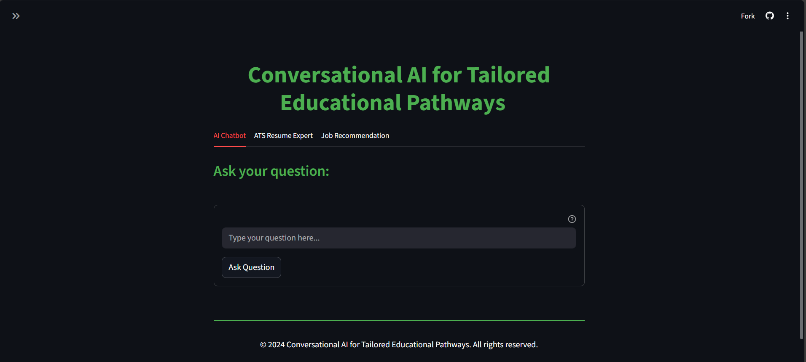
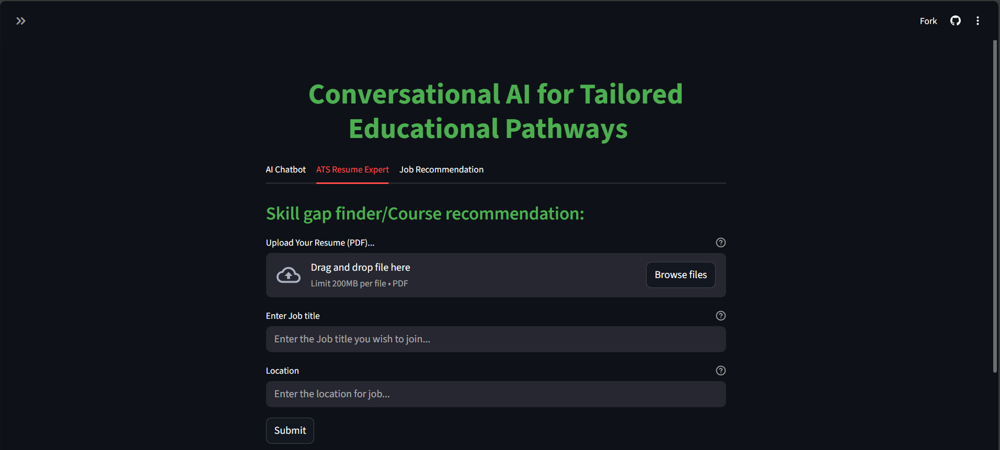
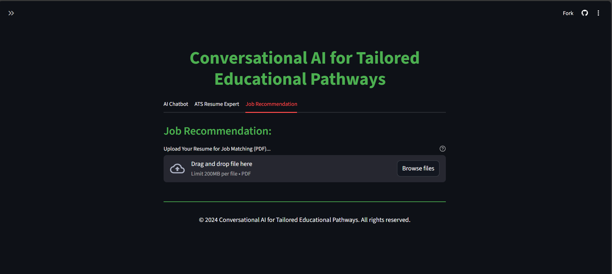

## 🚀 Executive Summary

- **Goal:** A conversational application that turns a resume into an **actionable learning and career plan**—chat with an AI tutor, find **skill gaps**, get **course recommendations**, and see **top job matches**.
- **How it works:** 
  - Parses a **PDF resume**, normalizes to **ESCO** skill labels, and compares against real job descriptions stored in **MongoDB Atlas**.
  - Uses **Gemini (Google Generative AI)** to return a structured **ATS-style JSON** summary with **missing skills**.
  - Ranks jobs with **TF-IDF + cosine similarity** to surface the **Top-5** relevant roles.
  - Presents everything in a clean **Streamlit** UI with three tabs: **AI Chatbot**, **ATS Resume Expert**, and **Job Recommendation**.
- **Why it’s useful:** Bridges resume–job **vocabulary gaps**, points to **courses** to close skills, and provides **transparent, reproducible** job matching.

---

## 🧰 Packages & Tools

- **Python** 3.9+  
- **App/UI:** `streamlit`  
- **LLM:** `google-generativeai` (Gemini)  
- **PDF parsing:** `PyPDF2`  
- **Data/ML:** `pandas`, `numpy`, `scikit-learn` (`TfidfVectorizer`, `cosine_similarity`)  
- **Database:** `pymongo`, `certifi` (TLS) — **MongoDB Atlas**  
- **Utilities:** `python-dotenv` (optional for `.env`), `urllib.parse`, `json`, `re`, `os`

---

## 🧩 What each tab does (under the hood)

### 1) AI Chatbot

- **Purpose:** Free-form Q&A about careers, skills, learning paths, and next steps.
- **How it works:**
  - Uses **Gemini** to answer the user’s prompt (`get_gemini_response()`), with the API key read from `GOOGLE_API_KEY`.
  - Maintains conversation state in `st.session_state.chat_history` so prior Q&A persists.
  - Simple CSS keeps the input anchored at the bottom to feel like a chat interface.

---

### 2) ATS Resume Expert (Skill-gap finder & Course recommendation)

- **Purpose:** Read a **PDF resume**, detect **missing skills** for a target job, and generate **course links** to close gaps.
- **How it works:**
  1. **Resume ingestion:** `input_pdf_text()` extracts text from the uploaded PDF (via `PyPDF2`).
  2. **Job retrieval:** `fetch_jobs(skill_name, location)` queries **MongoDB Atlas** (using `MONGODB_URI`) to pull relevant job descriptions (regex on job title).
  3. **LLM comparison:** The resume text + concatenated job descriptions are sent to **Gemini** with an ATS-style prompt that requests strict **JSON** containing a `"Profile Summary"` and `"MissingKeywords"`, which is parsed with `json.loads(...)`.
  4. **Courses:** For every missing keyword, the app builds **Coursera** and **Udemy** search URLs (URL-encoded) and displays them for immediate upskilling.

> Tip: keep the LLM prompt’s “return JSON” instruction strict so parsing doesn’t fail.

---

### 3) Job Recommendation (resume → top job matches)

- **Purpose:** Rank real job postings against your resume and return the **Top-5** closest matches with clickable links.
- **How it works:**
  1. **Resume → skills:** `extract_text_from_pdf()` reads the PDF; `match_keywords()` scans for **ESCO** skill names stored in MongoDB (`ESCO_Skills.Skills`, field `preferredLabel`). The matched skills are used as the resume signal.
  2. **Job corpus:** Loads job posts from `job_database.Job_Listings` and takes the `Description` field as the comparison set.
  3. **Vectorize & rank:** Builds a **TF-IDF** matrix over `[resume_skills] + job_descriptions` and computes **cosine similarity** (`scikit-learn`), then sorts and keeps the top 5 jobs.
  4. **Results UI:** Renders a small table with **clickable links** to each job (`escape=False` in the HTML render).

---

## 🔐 Config & Services

- **Environment variables**
  - `GOOGLE_API_KEY` – key for Gemini.
  - `MONGODB_URI` – MongoDB Atlas connection string (TLS enabled).
- **MongoDB databases/collections used**
  - `job_database.Course` – job descriptions used by the ATS skill-gap step.
  - `ESCO_Skills.Skills` – canonical ESCO skill labels for keyword matching.
  - `job_database.Job_Listings` – job postings used by the Job Recommendation ranker.

---

## 🧠 Mini Architecture Recap

1. **Streamlit UI** with three tabs (Chat, ATS Skill-Gap, Job Recommendation).  
2. **PDF parsing** (`PyPDF2`) to ingest resumes.  
3. **Gemini LLM** for ATS-style evaluation + structured JSON skill gaps.  
4. **MongoDB Atlas** for skills and jobs (Python driver with TLS).  
5. **TF-IDF + Cosine similarity** to rank jobs to the resume’s ESCO skill signal.  
6. **Course links** auto-generated per missing skill for immediate learning actions.
